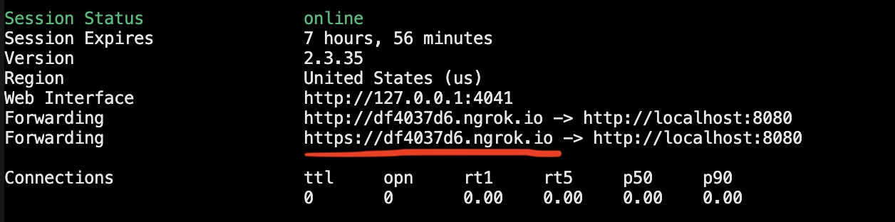
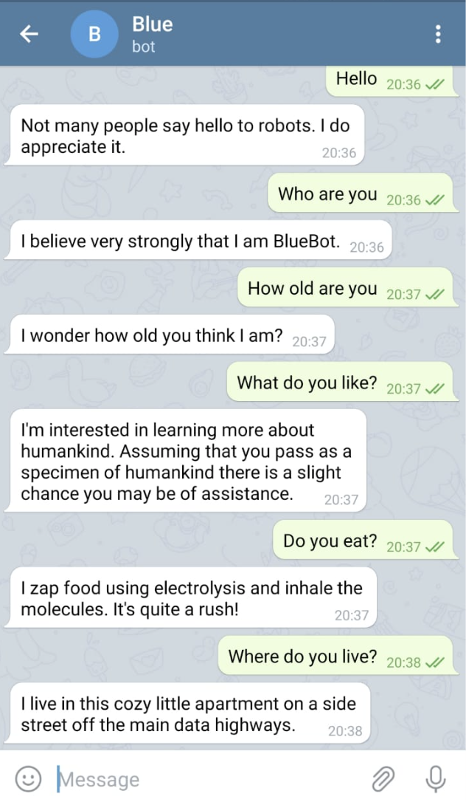

[](https://www.python.org/)
[](https://www.python.org/downloads/release/python-360/) 
[](https://www.linkedin.com/in/divyani-panda-5a8345194/) 
[](https://github.com/7divs7?tab=followers) 
[](https://GitHub.com/7divs7/BlueBot/stargazers/)

# BlueBot
A smart Telegram Bot that'll give you company during quarantine :P


# Instructions
```bash
$ python3 BlueBot/bot.py
```

Start ngrok to set up WebHook in order to receive a simple event-notification via HTTP POST
```bash
$ ./ngrok http 8080
```

Use the URL for setting up WebHook as shown below


Set up WebHook and check if it was successful
 https://api.telegram.org/bot1{your_bot_token}/setWebhook?url={ngrok_url}
 https://api.telegram.org/bot{your_bot_token}/getWebhookInfo

Now you're good to go!

# Output


## Author
[](https://www.linkedin.com/in/divyani-panda-5a8345194/)
* [*Divyani Panda*](https://github.com/7divs7)
